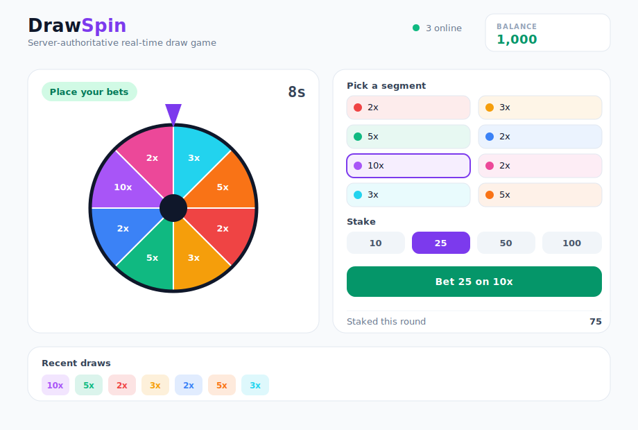

# DrawSpin

A little real-time draw game. The server runs the round, picks the winning
segment, and tells everyone the result. The browsers just draw the wheel and
spin it to whatever the server decided, so two tabs always land on the same
spot.

I built it mostly to play with WebSockets and a Three.js wheel, but the
server-authoritative part is the bit I actually care about: the client never
gets to pick the outcome.



## Stack

- Client: React + TypeScript + Vite, Three.js for the wheel, Tailwind for the UI.
- Server: Node + `ws`, also TypeScript.
- They talk over a single WebSocket, plain JSON messages back and forth.

## Running it

You need two terminals, one for the server and one for the client.

Server:

```bash
cd server
npm install
npm run dev      # listens on ws://localhost:8080
```

Client:

```bash
cd client
npm install
npm run dev      # http://localhost:5173
```

Open http://localhost:5173. If your server isn't on the default port, point the
client at it with `VITE_WS_URL`, e.g. `VITE_WS_URL=ws://localhost:9000 npm run dev`.

To see the sync, open it in two tabs side by side. Both wheels spin together and
stop on the same wedge. Refresh one mid-spin and it catches up to where the
other one is instead of starting over.

## How it works

**The server owns the game.** There's one loop running for everyone. It cycles
through three phases: `betting` (you can place bets), `drawing` (wheel is
spinning), and `result` (payouts). When betting closes it picks the winner with
`crypto.randomInt`, so the outcome is decided on the server and only then sent
out. It also rolls a `spinSeed` that goes to every client, which is how all the
wheels animate to the exact same place.

**Bets are validated server-side.** The client can show buttons and disable
them, but the server is the one that checks the phase, the segment, the amount,
and your balance before it takes the stake. Settlement happens in the result
phase: it walks each player's bets, pays out the winners, and sends back the new
balance. The client balance is only ever a number the server told it.

**The wheel is just rendering.** `Wheel.tsx` builds the wedges, rim and pointer
once with Three.js, then spins toward `winningIndex`. The landing angle is fixed
by which segment won, and the number of full turns comes from `spinSeed`, so the
whole path is the same for everybody.

**Refresh stays in sync.** This was the annoying part. The spin is driven off
the server clock, not the browser's local time. Each client measures its offset
from the server (`serverNow - Date.now()`) and the wheel works out how far into
the spin it should already be. So if you reload halfway through a draw, the wheel
jumps to the right point and finishes with everyone else. Reload during the
result and it just parks on the winning segment.